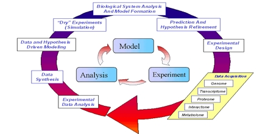
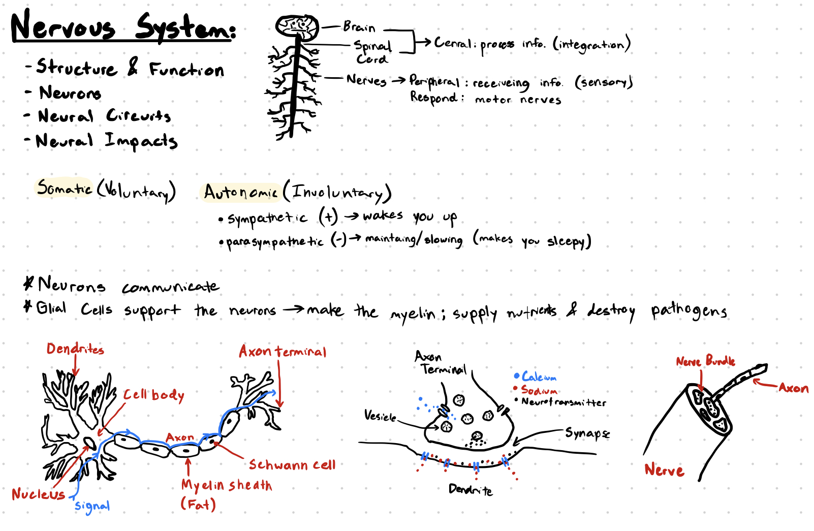

+++
title = "BIO:103 Portfolio"
outputs = ["Reveal"]
+++

# 🔬 BIO 103

## Portfolio

By: Aiden Olsen

---

## 📋 Overview

- [Science Concepts](#science-concepts)
- [Science Skills](#science-skills)

---

{}


# 🦠 Science Concepts ↓

---



### Hypothesis

Hypothesis are an extremely important part of the scientific method. A hypothesis is typically referred to as an
"educated guess" of what will happen.

During this term I made a hypothesis that being on my phone for less amount of time before bed would increase
the amount of sleep I got in a night because of reduced blue light exposure.

---



### Systems and Models

Sytems and Models play a huge role in our understanding of how complex biological organisms work. For example,
during the term, we have broken down the human body into many smaller systems in order to understand how our
larger systems work.

{}

---

{}


# 🧠 Science Skills ↓

---



### Note Taking

One of the most essential components of science is note taking. Without it, it is easy to forget what is learned
during the scientific process. Below is an example of note taking I've done this term, specifiaclly about the 
nervous system.

---



### Recording Data

Data helps us understand the results of our experiments and show correlations between different sets of data.
For our body parameter assignment this term, we were tasked with collecting data on a specific bady parameter.
Most of the time data is collected in a table and an example can be seen in the slide below.

---



### Data Collection Table

| Day of the Week     | M | T | W | R | F |
|---------------------|---|---|---|---|---|
| Minutes of Exercise |   |   |   |   |   |
| Hours of Sleep      |   |   |   |   |   |
| Time on Phone       |   |   |   |   |   |

{}

